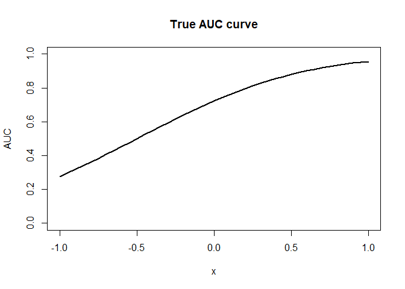
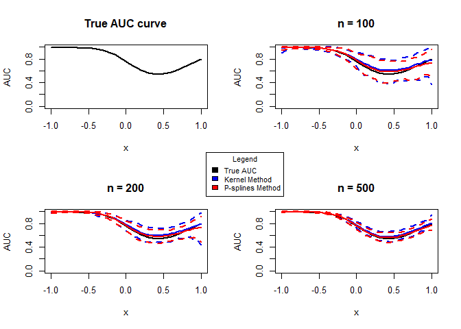

Simulation Study Scenario 1
================
Guiomar Pescador-Barrios

This document presents a simulation study where we compare the
performance of the P-splines method for estimating the
covariate-specific ROC curve against that of an estimator based on
kernel methods to estimate mean and variance functions. The references
for the kernel approach are Pardo-Fernandez et al. (2011, Scandinavian
Journal of Statistics) and Rodriguez-Alvarez et al. (2011, Statistics
and Computing). This kernel approach is available in the of the package.

We consider the scenario refers as ‘Scenario 1’ in the report, where


Te covariates,

and
,
are assumed to be independently and uniformly distributed on the
")
interval. For simplicity, we further assume that errors are normally
distributed, that is,
,
")
for

and
.
As sample sizes for the simulated data, we will consider
 = (100,\,100)"),
 = (200,\,200)"),
and
 = (500,\,500)").

## P-Splines estimates function

``` r
ps_est_fun <- function(y, x, x_pred) {
  
  # Returns the mean and variances functions estimates 
  # of the P-splines regression model for a single covariate
  
  # Step 1
  fit <- gam(y ~ s(x, bs = "ps"))
  df_pred <- data.frame(x = x_pred)
  
  mean_fitted_values <- fit$fitted.values
  mean_pred <- predict(fit, df_pred)
  
  # Step 2
  y_wr <- log((y - mean_fitted_values)^2)
  
  fit_wr <- gam(y_wr ~ s(x, bs = "ps"))
  
  # Step 3
  cov <- exp(fit_wr$fitted.values)
  theta_hat <- sum(((y - mean_fitted_values)^2) * cov)/sum((cov)^2)
  
  sigma2_fitted_values <- theta_hat*exp(fit_wr$fitted.values)

  sigma2_pred <- theta_hat * exp(predict(fit_wr, df_pred))
  
  return(list("mu_fitted" = mean_fitted_values, 
              "sigma2_fitted" = sigma2_fitted_values,
              "mu_pred" = mean_pred, 
              "sigma2_pred" = sigma2_pred))
}
```

## P-Splines ROC function

``` r
roc_ps <- function(yd, xd, yh, xh, p, x_pred) {
  
  # Returns the ROC and AUC estimates 
  # of the P-splines regression model with 1 covariate 

  # Call PS function to obtain the mean and variance estimates
  fit_h <- ps_est_fun(y = yh, x = xh, x_pred = x_pred)
  fit_d <- ps_est_fun(y = yd, x = xd, x_pred = x_pred)
  
  # Assign estimates to a variable
  mu_h <- fit_h$mu_pred
  sigma_h <- sqrt(fit_h$sigma2_pred)
  
  mu_d <- fit_d$mu_p
  sigma_d <- sqrt(fit_d$sigma2_pred)
  
  # Residuals estimates
  eps_h <- (yh- fit_h$mu_fitted)/sqrt(fit_h$sigma2_fitted)  
  eps_d <- (yd - fit_d$mu_fitted)/sqrt(fit_d$sigma2_fitted)

  # Distribution Function 
  F_eps_d <- ecdf(eps_d)
  
  # Variables to store the ROC curve and AUC given covariate values
  roc <- matrix(0, nrow = length(p), ncol = length(x_pred))
  auc <- numeric(length(xpred))
  
  # Calculate ROC curve and corresponding AUC 
  for(j in 1:length(xpred)){
    roc[, j] <- 1 - F_eps_d(((mu_h[j] - mu_d[j])/sigma_d[j]) + 
                              (sigma_h[j]/sigma_d[j])*quantile(eps_h, 1 - p, type = 1))
    auc[j] <- sum(roc[, j])/length(p)
  }
  return(list("ROC" = roc, "AUC" = auc))
}
```

## Simulation function

``` r
simulation_fun <- function(roc_true, auc_true, nh, nd, nrep, xpred, p) {
  # Helper function to carry out the simulation
  # Returns MSE for both methods considered
  
  
  # Initialise variables
  yh <- xh <- epsh <- matrix(0, nrow = nh, ncol = nrep)
  yd <- xd <- epsd <- matrix(0, nrow = nd, ncol = nrep)
  
 # Generate data
 set.seed(123)
  for(j in 1:nrep){
    xh[, j] <- runif(nh, -1, 1)
    epsh[, j] <- rnorm(nh, 0, 1)
    yh[, j] <-  0.5 + xh[, j] + 1.5*epsh[, j]
    
    xd[, j] <- runif(nd, -1, 1)
    epsd[, j] <- rnorm(nd, 0, 1)
    yd[, j] <- 2 + 4*xd[, j] + 2*epsd[, j]
  }
  
  # Inialise variable to store results
  auc_kernel <-  auc_ps <- matrix(0, nrow = length(xpred), ncol = nrep)
  MSE_kernel <- MSE_ps <-  numeric(length(xpred))
  
  # Caculate estimates
  for(j in 1:nrep){
    
    df <- data.frame("y" = c(yh[, j], yd[, j]), "x" = c(xh[, j], xd[ ,j]), 
                     "status" = c(rep(0, nh), rep(1, nd)))
    df.pred <- data.frame("x" = xpred)
    
    # Kernel method
    cROC_kernel <- cROC.kernel(marker = "y",
                                   covariate = "x",
                                   group = "status",
                                   tag.h = 0,
                                   data = df,
                                   newdata = df.pred,
                                   bw = "LS",
                                   regtype = "LL",
                                   p = p,
                                   pauc = pauccontrol(compute = FALSE),
                                   B = 0)
    # P-splines method
    cROC_ps <- roc_ps(yd = yd[,j], xd = xd[,j], yh = yh[,j], xh = xh[,j], 
                      p = p, x_pred = xpred)
     
    # Store results
    roc_kernel <- t(cROC_kernel$ROC$est)
    MSE_kernel[j] <- mean(mean((roc_kernel - roc_true)^2))
    auc_kernel[, j] <- cROC_kernel$AUC
    
    roc_ps <- cROC_ps$ROC
    MSE_ps[j] <- mean(mean((roc_ps - roc_true)^2))
    auc_ps[, j] <- cROC_ps$AUC
    
  } 
  
  # Calculate means and CI
  auc_kernel_m <- apply(auc_kernel, 1, mean)
  auc_kernel_l <- apply(auc_kernel, 1, quantile, 0.025)
  auc_kernel_h <- apply(auc_kernel, 1, quantile, 0.975)
  
  auc_ps_m <- apply(auc_ps, 1, mean)
  auc_ps_l <- apply(auc_ps, 1, quantile, 0.025)
  auc_ps_h <- apply(auc_ps, 1, quantile, 0.975)
  
  # Plot approximation to true AUC
  plt <- plot(xpred, auc_true, lwd = 2, type = "l",
       xlim = c(-1, 1), ylim = c(0, 1),
       xlab = expression(x), ylab = "AUC", main=paste("n =",nd))
  
  plt <- plt + lines(xpred, auc_kernel_m, col = "blue2", lwd = 2)
  plt <- plt + lines(xpred, auc_kernel_l, col = "blue2", lty = 2, lwd = 2)
  plt <- plt + lines(xpred, auc_kernel_h, col = "blue2", lty = 2, lwd = 2)
  
  plt <- plt +lines(xpred, auc_ps_m, col = "red", lwd = 2)
  plt <- plt +lines(xpred, auc_ps_l, col = "red", lty = 2, lwd = 2)
  plt <- plt +lines(xpred, auc_ps_h, col = "red", lty = 2, lwd = 2)
  
  return(list("K" = MSE_kernel, "PS" = MSE_ps))
}
```

## Simulation

``` r
xpred <- seq(-1, 1, by = 0.05)
p <- seq(0, 1, len = 101)

# nonlinear scenario -- true quantities
roc_true <- matrix(0, nrow = length(p), ncol = length(xpred))
auc_true <- numeric(length(xpred))
for(l in 1:length(xpred)){
  for(l in 1:length(xpred)){
  roc_true[,l]  <- 1 - pnorm(qnorm(1 - p, (0.5 + xpred[l]), 1.5),
                             (2 + 4*xpred[l]), 2)
  auc_true[l] <- sum(roc_true[,l])/length(p)
}
}

#plot true auc
plot(xpred, auc_true, lwd = 2, type = "l",
     xlim = c(-1, 1), ylim = c(0, 1),
     xlab = expression(x), ylab = "AUC",  main="True AUC curve")
```

<!-- -->

## Results

``` r
par(mfrow=c(2,2))

#plot true auc for comparison
plot(xpred, auc_true, lwd = 2, type = "l",
     xlim = c(-1, 1), ylim = c(0, 1),
     xlab = expression(x), ylab = "AUC", main="True AUC curve")

# Samples sizes and repetitions
nh <- c(100,200,500)
nd <- c(100,200,500)
nrep <- 100

# Initialise average MSE and SD error
mu_MSE_k <- mu_MSE_ps <- sd_MSE_k <- sd_MSE_ps <-  numeric(length = 3)

# Simulation
for (i in 1:3){
  results <- simulation_fun(roc_true, auc_true, nh[i], nd[i], nrep, xpred, p)
  mu_MSE_k[i] <- mean(results$K)
  sd_MSE_k[i] <- sd(results$K)
  mu_MSE_ps[i] <- mean(results$PS)
  sd_MSE_ps[i] <- sd(results$PS)
}
legend(-2,2,ncol =1,legend=c("True AUC","Kernel Method","P-splines Method"), fill=c("black","blue2","red"), title="Legend", xpd=NA, cex = 0.8)
```

<!-- -->

``` r
# Put results into data frame
df <- data.frame(
  "AVERAGE MSE" = c(mu_MSE_k[1], mu_MSE_k[2], mu_MSE_k[3]),
  "SD" = c(sd_MSE_k[1], sd_MSE_k[2], sd_MSE_k[3]),
   "AVERAGE MSE PS" = c(mu_MSE_ps[1], mu_MSE_ps[2], mu_MSE_ps[3]),
  "SD PS" = c(sd_MSE_ps[1], sd_MSE_ps[2], sd_MSE_ps[3]))
colnames(df) <- c("AVERAGE MSE KERNEL", "SD KERNEL", "AVERAGE MSE PS", "SD PS")
rownames(df) = c("n = 100", "n = 200", "n = 500")
knitr::kable(df, escape = FALSE, digits = 6, caption = "Summary of values.")
```
