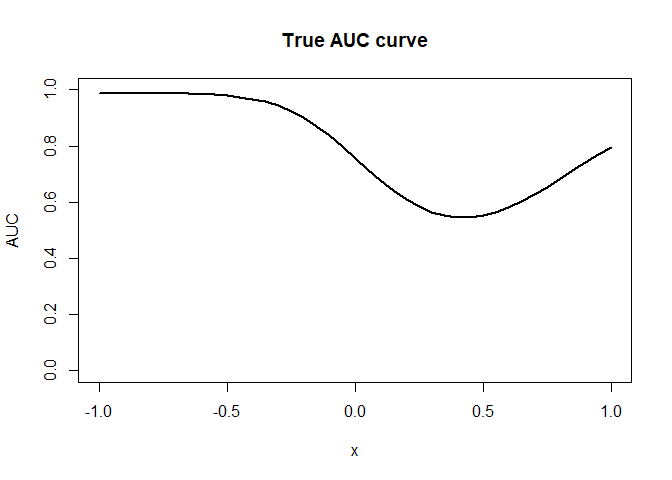
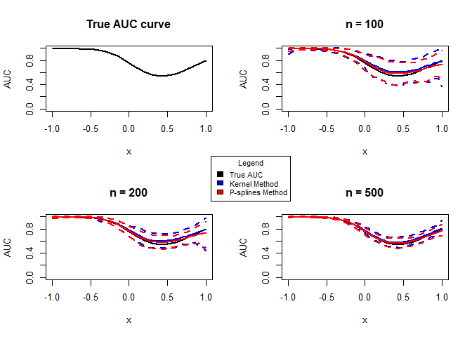

Simulation Study Scenario 2
================
Guiomar Pescador-Barrios

## P-Splines estimates function

``` r
ps_est_fun <- function(y, x, x_pred) {
  
  # Returns the mean and variances functions estimates 
  # of the P-splines regression model for a single covariate
  
  # Step 1
  fit <- gam(y ~ s(x, bs = "ps"))
  df_pred <- data.frame(x = x_pred)
  
  mean_fitted_values <- fit$fitted.values
  mean_pred <- predict(fit, df_pred)
  
  # Step 2
  y_wr <- log((y - mean_fitted_values)^2)
  
  fit_wr <- gam(y_wr ~ s(x, bs = "ps"))
  
  # Step 3
  cov <- exp(fit_wr$fitted.values)
  theta_hat <- sum(((y - mean_fitted_values)^2) * cov)/sum((cov)^2)
  
  sigma2_fitted_values <- theta_hat*exp(fit_wr$fitted.values)

  sigma2_pred <- theta_hat * exp(predict(fit_wr, df_pred))
  
  return(list("mu_fitted" = mean_fitted_values, 
              "sigma2_fitted" = sigma2_fitted_values,
              "mu_pred" = mean_pred, 
              "sigma2_pred" = sigma2_pred))
}
```

## P-Splines ROC function

``` r
roc_ps <- function(yd, xd, yh, xh, p, x_pred) {
  
  # Returns the ROC and AUC estimates 
  # of the P-splines regression model with 1 covariate 

  # Call PS function to obtain the mean and variance estimates
  fit_h <- ps_est_fun(y = yh, x = xh, x_pred = x_pred)
  fit_d <- ps_est_fun(y = yd, x = xd, x_pred = x_pred)
  
  # Assign estimates to a variable
  mu_h <- fit_h$mu_pred
  sigma_h <- sqrt(fit_h$sigma2_pred)
  
  mu_d <- fit_d$mu_p
  sigma_d <- sqrt(fit_d$sigma2_pred)
  
  # Residuals estimates
  eps_h <- (yh- fit_h$mu_fitted)/sqrt(fit_h$sigma2_fitted)  
  eps_d <- (yd - fit_d$mu_fitted)/sqrt(fit_d$sigma2_fitted)

  # Distribution Function 
  F_eps_d <- ecdf(eps_d)
  
  # Variables to store the ROC curve and AUC given covariate values
  roc <- matrix(0, nrow = length(p), ncol = length(x_pred))
  auc <- numeric(length(xpred))
  
  # Calculate ROC curve and corresponding AUC 
  for(j in 1:length(xpred)){
    roc[, j] <- 1 - F_eps_d(((mu_h[j] - mu_d[j])/sigma_d[j]) + 
                              (sigma_h[j]/sigma_d[j])*quantile(eps_h, 1 - p, type = 1))
    auc[j] <- sum(roc[, j])/length(p)
  }
  return(list("ROC" = roc, "AUC" = auc))
}
```

## Simulation function

``` r
simulation_fun <- function(roc_true, auc_true, nh, nd, nrep, xpred, p) {
  # Helper function to carry out the simulation
  # Returns MSE for both methods considered
  
  
  # Initialise variables
  yh <- xh <- epsh <- matrix(0, nrow = nh, ncol = nrep)
  yd <- xd <- epsd <- matrix(0, nrow = nd, ncol = nrep)
  
 # Generate data
 set.seed(123)
  for(j in 1:nrep){
    xh[, j] <- runif(nh, -1, 1)
    epsh[, j] <- rnorm(nh, 0, 1)
    yh[, j] <-  sin(pi*xh[, j]) + (1 + 0.75*xh[, j])*epsh[, j]
    
    xd[, j] <- runif(nd, -1, 1)
    epsd[, j] <- rnorm(nd, 0, 1)
    yd[, j] <- 1 + xd[, j]^2 + sqrt(exp(xd[, j]))*epsd[, j]
  }
  
  # Inialise variable to store results
  auc_kernel <-  auc_ps <- matrix(0, nrow = length(xpred), ncol = nrep)
  MSE_kernel <- MSE_ps <-  numeric(length(xpred))
  
  # Caculate estimates
  for(j in 1:nrep){
    
    df <- data.frame("y" = c(yh[, j], yd[, j]), "x" = c(xh[, j], xd[ ,j]), 
                     "status" = c(rep(0, nh), rep(1, nd)))
    df.pred <- data.frame("x" = xpred)
    
    # Kernel method
    cROC_kernel <- cROC.kernel(marker = "y",
                                   covariate = "x",
                                   group = "status",
                                   tag.h = 0,
                                   data = df,
                                   newdata = df.pred,
                                   bw = "LS",
                                   regtype = "LL",
                                   p = p,
                                   pauc = pauccontrol(compute = FALSE),
                                   B = 0)
    # P-splines method
    cROC_ps <- roc_ps(yd = yd[,j], xd = xd[,j], yh = yh[,j], xh = xh[,j], 
                      p = p, x_pred = xpred)
     
    # Store results
    roc_kernel <- t(cROC_kernel$ROC$est)
    MSE_kernel[j] <- mean(mean((roc_kernel - roc_true)^2))
    auc_kernel[, j] <- cROC_kernel$AUC
    
    roc_ps <- cROC_ps$ROC
    MSE_ps[j] <- mean(mean((roc_ps - roc_true)^2))
    auc_ps[, j] <- cROC_ps$AUC
    
  } 
  
  # Calculate means and CI
  auc_kernel_m <- apply(auc_kernel, 1, mean)
  auc_kernel_l <- apply(auc_kernel, 1, quantile, 0.025)
  auc_kernel_h <- apply(auc_kernel, 1, quantile, 0.975)
  
  auc_ps_m <- apply(auc_ps, 1, mean)
  auc_ps_l <- apply(auc_ps, 1, quantile, 0.025)
  auc_ps_h <- apply(auc_ps, 1, quantile, 0.975)
  
  # Plot approximation to true AUC
  plt <- plot(xpred, auc_true, lwd = 2, type = "l",
       xlim = c(-1, 1), ylim = c(0, 1),
       xlab = expression(x), ylab = "AUC", main=paste("n =",nd))
  
  plt <- plt + lines(xpred, auc_kernel_m, col = "blue2", lwd = 2)
  plt <- plt + lines(xpred, auc_kernel_l, col = "blue2", lty = 2, lwd = 2)
  plt <- plt + lines(xpred, auc_kernel_h, col = "blue2", lty = 2, lwd = 2)
  
  plt <- plt +lines(xpred, auc_ps_m, col = "red", lwd = 2)
  plt <- plt +lines(xpred, auc_ps_l, col = "red", lty = 2, lwd = 2)
  plt <- plt +lines(xpred, auc_ps_h, col = "red", lty = 2, lwd = 2)
  
  return(list("K" = MSE_kernel, "PS" = MSE_ps))
}
```

## Simulation

``` r
xpred <- seq(-1, 1, by = 0.05)
p <- seq(0, 1, len = 101)

# nonlinear scenario -- true quantities
roc_true <- matrix(0, nrow = length(p), ncol = length(xpred))
auc_true <- numeric(length(xpred))
for(l in 1:length(xpred)){
  roc_true[,l]  <- 1 - pnorm(qnorm(1 - p, sin(pi*(xpred[l])), (1 + 0.75*xpred[l])),(1 + xpred[l]^2), sqrt(exp(xpred[l])))
  auc_true[l] <- sum(roc_true[,l])/length(p)
}

#plot true auc
plot(xpred, auc_true, lwd = 2, type = "l",
     xlim = c(-1, 1), ylim = c(0, 1),
     xlab = expression(x), ylab = "AUC",  main="True AUC curve")
```

<!-- -->

## Results

``` r
par(mfrow=c(2,2))

#plot true auc for comparison
plot(xpred, auc_true, lwd = 2, type = "l",
     xlim = c(-1, 1), ylim = c(0, 1),
     xlab = expression(x), ylab = "AUC", main="True AUC curve")

# Samples sizes and repetitions
nh <- c(100,200,500)
nd <- c(100,200,500)
nrep <- 100

# Initialise average MSE and SD error
mu_MSE_k <- mu_MSE_ps <- sd_MSE_k <- sd_MSE_ps <-  numeric(length = 3)

# Simulation
for (i in 1:3){
  results <- simulation_fun(roc_true, auc_true, nh[i], nd[i], nrep, xpred, p)
  mu_MSE_k[i] <- mean(results$K)
  sd_MSE_k[i] <- sd(results$K)
  mu_MSE_ps[i] <- mean(results$PS)
  sd_MSE_ps[i] <- sd(results$PS)
}
legend(-2,2,ncol =1,legend=c("True AUC","Kernel Method","P-splines Method"), fill=c("black","blue2","red"), title="Legend", xpd=NA, cex = 0.8)
```

<!-- -->

``` r
# Put results into data frame
df <- data.frame(
  "AVERAGE MSE" = c(mu_MSE_k[1], mu_MSE_k[2], mu_MSE_k[3]),
  "SD" = c(sd_MSE_k[1], sd_MSE_k[2], sd_MSE_k[3]),
   "AVERAGE MSE PS" = c(mu_MSE_ps[1], mu_MSE_ps[2], mu_MSE_ps[3]),
  "SD PS" = c(sd_MSE_ps[1], sd_MSE_ps[2], sd_MSE_ps[3]))
colnames(df) <- c("AVERAGE MSE KERNEL", "SD KERNEL", "AVERAGE MSE PS", "SD PS")
rownames(df) = c("n = 100", "n = 200", "n = 500")
knitr::kable(df, escape = FALSE, digits = 6, caption = "Summary of values.")
```
