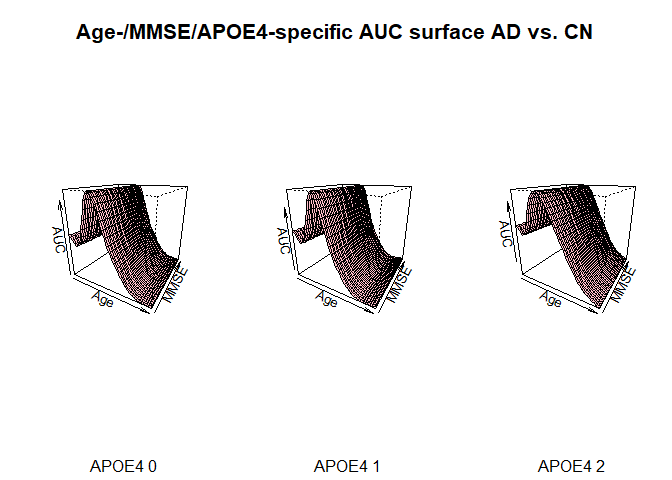

Conditional AUC P-splines Estimate, two covariates case
================
Guiomar Pescador-Barrios

This document provides an example of the estimation of the conditional
AUC using P-splines method applied to a data set concerning Alzheimer’s
disease. The test results correspond to the concentration of Tau CSF
biomaker. We consider the case of two covariates, age and APOE4 allele.
The first one is continuous while the second one is categorical with
three levels.

``` r
summary(ADNI[,c("tau", "age", "APOE4")])
```

    ##       tau              age            APOE4       
    ##  Min.   :   5.0   Min.   :55.00   Min.   :0.0000  
    ##  1st Qu.: 364.0   1st Qu.:67.00   1st Qu.:0.0000  
    ##  Median : 710.0   Median :73.00   Median :0.0000  
    ##  Mean   : 781.1   Mean   :72.33   Mean   :0.5252  
    ##  3rd Qu.:1148.2   3rd Qu.:77.00   3rd Qu.:1.0000  
    ##  Max.   :1797.0   Max.   :91.00   Max.   :2.0000

## Set-up model data

We consider Alzheimer’s diseased and cognitive normal groups as our
diseased and non diseased populations. The

subscript will refer to the diseased population and

to the nondiseased (“healthy”).

``` r
# Test results
yd <- ADNI$tau[ADNI$DX == 3]
yh <- ADNI$tau[ADNI$DX == 1]

# Age covariate
xd <- ADNI$age[ADNI$DX == 3]
xh <- ADNI$age[ADNI$DX == 1]

# APOE4 covariate
xd2 <- ADNI$APOE4[ADNI$DX == 3]
xh2 <- ADNI$APOE4[ADNI$DX == 1]
```

## P-splines estimator implementation

``` r
ps_est_fun <- function(y, x1, x2, x1_pred, x2_pred) {
  # Returns the mean and variances functions estimates 
  # for P-splines estimator given two covariates,
  # one continuous and one categorical
  
  # Step 1
  ##  Fits model for original samples
  fit <- gam(y ~ s(x1, bs = "ps") +  factor(x2))
  df_pred <- data.frame(x1 = x1_pred, x2 = x2_pred)
  ##  Obtains mean estimate
  mean_fitted_values <- fit$fitted.values
  mean_pred <- predict(fit, df_pred)
  
  # Step 2:  Transform working responses and fits model
  y_wr <- log((y - mean_fitted_values)^2)
  fit_wr <- gam(y_wr ~ s(x1, bs = "ps") + factor(x2))
  
  # Step 3: Obtain covariates and derive theta
  cov <- exp(fit_wr$fitted.values)
  theta_hat <- sum(((y - mean_fitted_values)^2) * cov)/sum((cov)^2)
  
  # Calculate sigma estimate
  sigma2_fitted_values <- theta_hat*exp(fit_wr$fitted.values)
  sigma2_pred <- theta_hat * exp(predict(fit_wr, df_pred))
  
  return(list("mu_fitted" = mean_fitted_values, 
              "sigma2_fitted" = sigma2_fitted_values,
              "mu_pred" = mean_pred, "sigma2_pred" = sigma2_pred))
}
```

``` r
roc_ps <- function(yd, x1d, x2d, yh, x1h, x2h, p, x1_pred, x2_pred) {
  # Returns the mean and variances functions estimates 
  # of the P-splines regression model with two covarites
  # as well as the corresponding the ROC and AUC estimates.

  # Call ps_est_fun to obtain the mean and variance estimates
  fit_h <- ps_est_fun(y = yh, x1 = x1h, x2 = x2h,
                      x1_pred = x1_pred, x2_pred = x2_pred)
  fit_d <- ps_est_fun(y = yd, x1 = x1d, x2 = x2d,
                      x1_pred = x1_pred, x2_pred = x2_pred)
  
  # Store estimates
  mu_h <- fit_h$mu_pred
  sigma_h <- sqrt(fit_h$sigma2_pred)
  
  mu_d <- fit_d$mu_p
  sigma_d <- sqrt(fit_d$sigma2_pred)
  
  # Variables to store the ROC curve and AUC given covariate values
  roc_cov_est <- matrix(0, nrow = length(p), ncol = length(x1_pred))
  auc_est <- numeric(length(x1_pred))
  
  # Calculate ROC curve and corresponding AUC 
  for(j in 1:length(x1_pred)){
    roc_cov_est[, j] <- 1 - pnorm(((mu_h[j] - mu_d[j])/sigma_d[j]) + (sigma_h[j]/sigma_d[j])*qnorm(1 - p))
    auc_est[j] <- sum(roc_cov_est[, j])/length(p)
  }
  
  return(list("fit_h" = fit_h, "fit_d" = fit_d,
              "rocs" = roc_cov_est, "auc" = auc_est, 
              "mu_h" = mu_h, "mu_d" = mu_d, 
              "sigma_h" = sigma_h, "sigma_d" = sigma_d))
}
```

## Bootstrap Intervals

``` r
boot_fun <- function(b, yd, x1d, x2d, yh, x1h, x2h, p, x1_pred, x2_pred) {
  # Returns case resample bootstrap CI for conditional AUC
  # Two covariates case
  
  # Set-up
  ## Number of bootstrap samples
  B <- b
  ## matrix to save AUC bootstrap estimates
  auc_est_boot <- matrix(0, nrow = length(x1_pred), ncol = B)
  
   # for all bootstrap samples
  for(l in 1:B){
    # Sample cases healthy population
    ind_h <- sample(1:length(yh), size = length(yh), replace = TRUE)
    yh_boot <- yh[ind_h]  
    x1h_boot <- x1h[ind_h]
    x2h_boot <- x2h[ind_h]

    # Sample cases diseased population
    ind_d <- sample(1:length(yd), size = length(yd), replace = TRUE)  
    yd_boot <- yd[ind_d]  
    x1d_boot <- x1d[ind_d]
    x2d_boot <- x2d[ind_d]
    
    # Estimate AUC curve using bootstrap sample
    aux <- roc_ps(yd = yd_boot, x1d = x1d_boot, x2d = x2d_boot,
                  yh = yh_boot, x1h = x1h_boot, x2h = x2h_boot,
                  p = p, x1_pred = x1_pred, x2_pred = x2_pred)
    # Store result in matrix
    auc_est_boot[, l] <- aux$auc
  }
  # Calculate confidence intervals
  auc_boot_l <- apply(auc_est_boot, 1, quantile, prob = 0.025)
  auc_boot_u <- apply(auc_est_boot, 1, quantile, prob = 0.975)
  
  return(list("auc_boot_l" = auc_boot_l, "auc_boot_u" = auc_boot_u))
  
}
```

``` r
boot_res_fun <- function(b, yd, x1d, x2d, yh, x1h, x2h, p, 
                         x1_pred, x2_pred, roc_original_sample) {
  # Returns resampling residuals bootstrap CI for 
  # conditional AUC
  
  # Set-up
  ## Number of bootstrap samples
  B <- b
  ## matrix to save AUC bootstrap estimates
  auc_est_boot_res <- matrix(0, nrow = length(x1_pred), ncol = B)
  
  # Sample with replacement from the estimated standardized residuals
  std_res_d_original_sample <- (yd - roc_original_sample$fit_d$mu_fitted)/sqrt(roc_original_sample$fit_d$sigma2_fitted)
  std_res_h_original_sample <- (yh - roc_original_sample$fit_h$mu_fitted)/sqrt(roc_original_sample$fit_h$sigma2_fitted)
  
   # Obtain mean function and variance estimates from the observed data
  ## Diseased population
  fit_d <- ps_est_fun(y = yd, x1 = x1d, x2 = x2d,  
                      x1_pred = x1d, x2_pred = x2d)
  mu_d <- fit_d$mu_pred
  sigma_d <- sqrt(fit_d$sigma2_pred)
  
  ## Healthy population
  fit_h <- ps_est_fun(y = yh, x1 = x1h, x2 = x2h,
                      x1_pred = x1h, x2_pred = x2h)
  
  mu_h <- fit_h$mu_pred
  sigma_h <- sqrt(fit_h$sigma2_pred)
  
  for(l in 1:B){
     # Construct bth bootstrap sample
    std_res_d_boot <- sample(std_res_d_original_sample, length(yd), replace = TRUE)
    yd_boot <- mu_d + sigma_d*std_res_d_boot
    
    std_res_h_boot <- sample(std_res_h_original_sample, length(yh), replace = TRUE)
    yh_boot <- mu_h + sigma_h*std_res_h_boot
    
    # Estimate AUC values for all values of the covariates
    # using the bootstrap sample
    aux <- roc_ps(yd = yd_boot, x1d = x1d, x2d = x2d,
                  yh = yh_boot, x1h = x1h, x2h = x2h,
                  p = p, x1_pred = x1_pred, x2_pred = x2_pred)
    
    # Store result in matrix
    auc_est_boot_res[, l] <- aux$auc
  }
  # Calculate confidence intervals
  auc_boot_res_l <- apply(auc_est_boot_res, 1, quantile, prob = 0.025)
  auc_boot_res_u <- apply(auc_est_boot_res, 1, quantile, prob = 0.975)
  
  return(list("auc_boot_res_l" = auc_boot_res_l, "auc_boot_res_u" = auc_boot_res_u))
  
}
```

``` r
plot_cov_fun<- function(yd, x1d, x2d, yh, x1h, x2h, x1_pred, ncat, cat) {
  
  # Define sequence p
  p <- seq(0, 1, len = 101)
  # Bootstrap samples
  b <- 100
  
  # for i in all the levels of the categorical covariate
  for (i in n_cat) {
    
    # define level to predict
    x2_pred <- rep(i, length(x1_pred))
    
    # ROC and AUC estimates from original sample
    roc_original_sample <- roc_ps(yd, x1d, x2d, yh, x1h, x2h, p, x1_pred, x2_pred)
    
    # Bootstrap CI
    boot_auc <- boot_fun(b, yd, x1d, x2d, yh, x1h, x2h, p, x1_pred, x2_pred)
    boot_res_auc <- boot_res_fun(b, yd, x1d, x2d, yh, x1h, x2h, p, x1_pred, x2_pred, roc_original_sample)

    # Plotting
    plot(x1_pred, roc_original_sample$auc, ylim = c(0, 1),
         type = "l", ylab = "AUC", xlab = "Age")
    lines(x1_pred, boot_auc$auc_boot_l, lty = 2, lwd = 1.5, col = "blue")
    lines(x1_pred, boot_auc$auc_boot_u, lty = 2, lwd = 1.5, col = "blue")

    lines(x1_pred, boot_res_auc$auc_boot_res_l, lty = 2, lwd = 1.5, col = "red")
    lines(x1_pred, boot_res_auc$auc_boot_res_u, lty = 2, lwd = 1.5, col = "red")
    text(82,0.1, CAT[i+1], cex=0.8)
  
  }
  
}
```

## Example

``` r
n_cat <- 0:2
CAT <- c("APOE4 0", "APOE4 1", "APOE4 2")
x_p <- seq(65,85, by = 0.5)

par(cex.axis=1.5, cex.lab=1.2, cex.main=2, cex.sub=1.5, mfrow=c(1,3),  mar = c(5.5, 4.5, 6.5, 2.5))
plot_cov_fun(yd, xd, xd2, yh, xh, xh2, x_p, n_cat, CAT)
title("Age-/APOE4-specific AUC curve", outer = TRUE, line = -2)
```

<!-- -->
